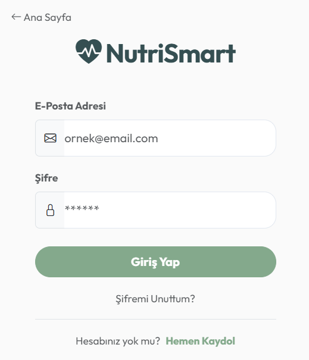
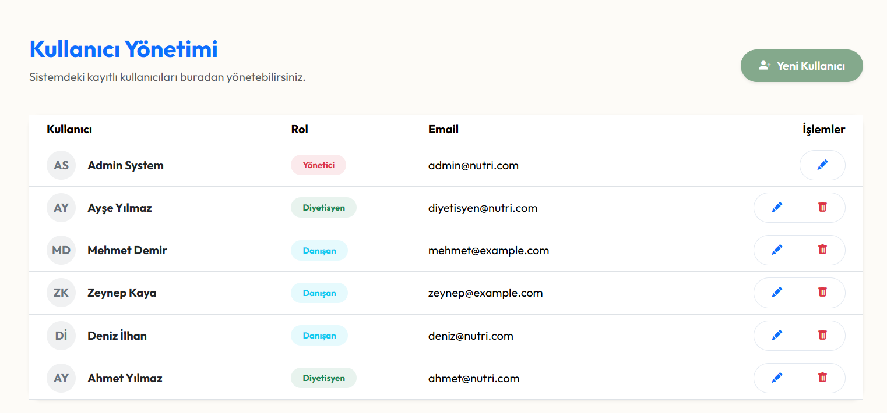
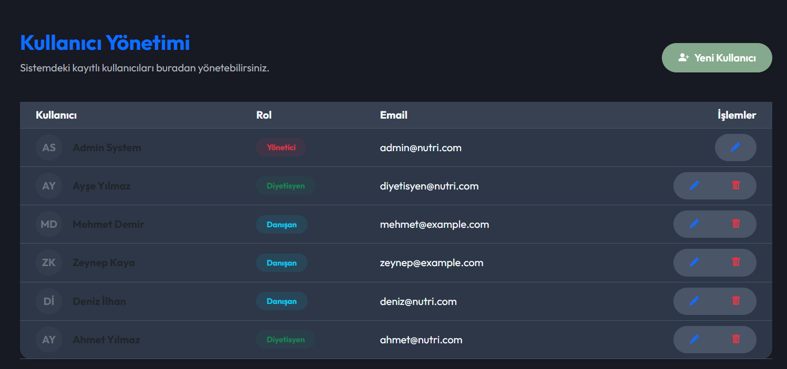
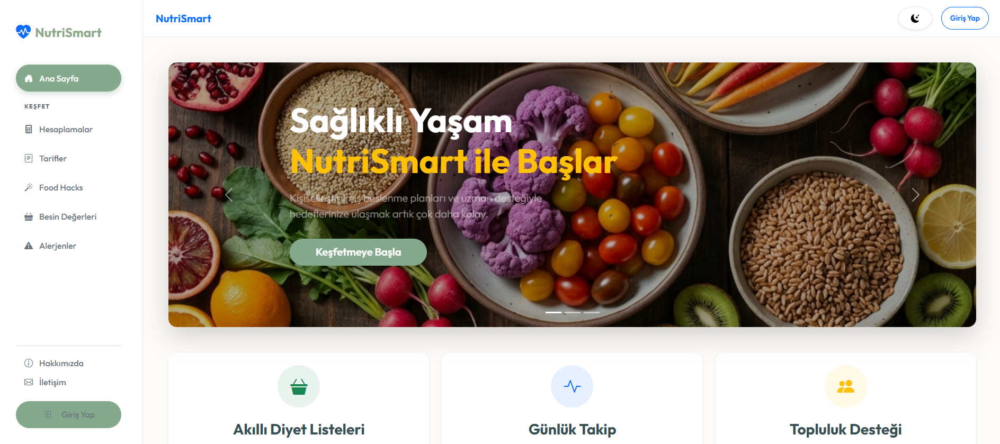
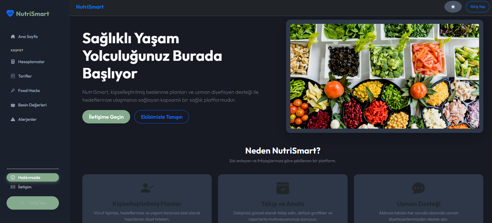
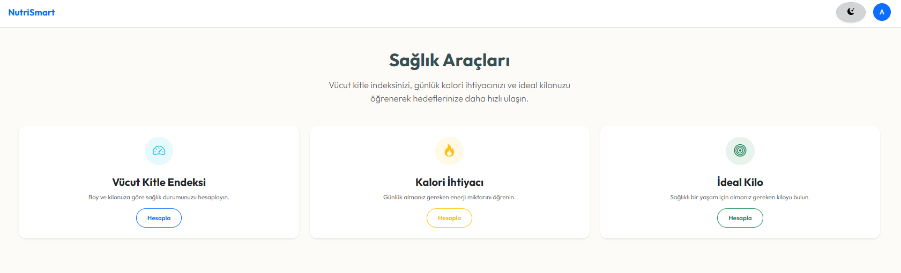
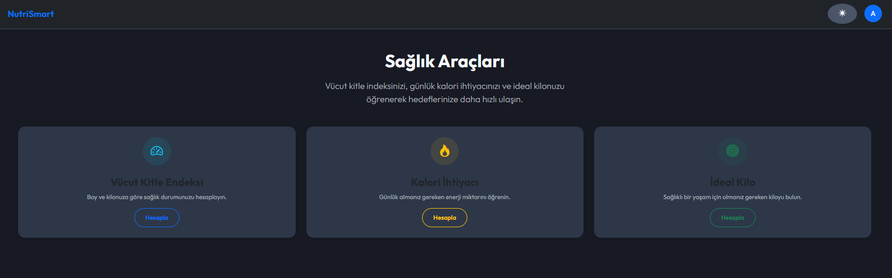
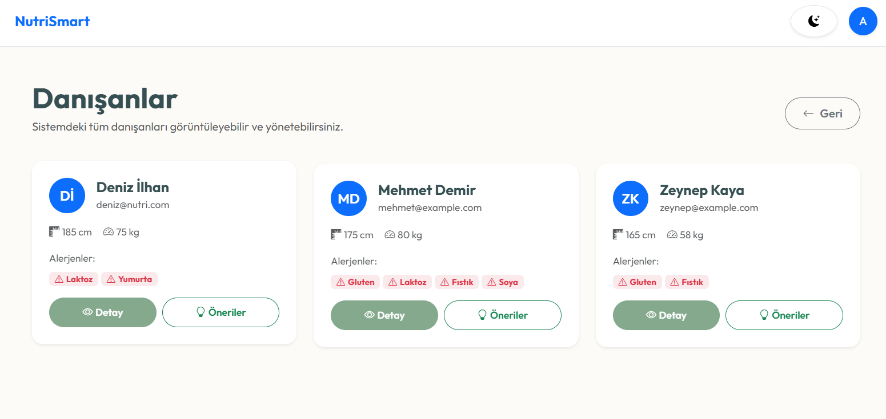
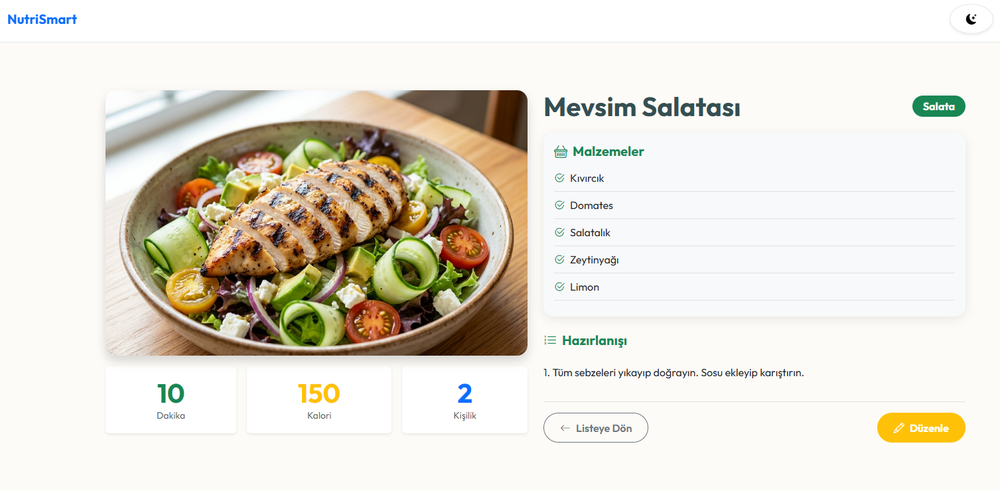
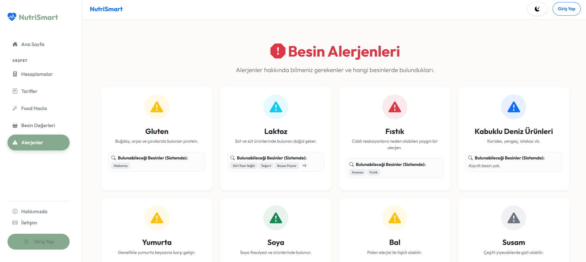

# NutriSmart 🍎🥗

NutriSmart, diyetisyenler ve danışanlar için geliştirilmiş kapsamlı bir beslenme ve diyet yönetim platformudur. Kullanıcı dostu arayüzü, gelişmiş karanlık mod desteği ve kişiselleştirilmiş raporlama özellikleri ile modern bir deneyim sunar.


## 🌟 Öne Çıkan Özellikler

*   **Rolu Tabanlı Yönetim:**
    *   **Diyetisyen Paneli:** Danışan takibi, besin ve alerjen yönetimi, görsel veri onarımı.
    *   **Danışan Paneli:** Kişisel beslenme raporu, güvenli/riskli besin listesi, BMI ve kalori hesaplamaları.
    *   **Admin:** Genel sistem yönetimi.
*   **Akıllı Besin & Alerjen Eşleşmesi:** Danışanların alerjilerine göre otomatik olarak "Güvenli" ve "Riskli" besinleri sınıflandıran algoritma.
*   **Modern UI & UX:**
    *   **Dark Mode:** Göz yormayan "Night Blue" (#171923) temalı karanlık mod.
    *   **Responsive Tasarım:** Mobil uyumlu sidebar ve arayüz.
*   **Raporlama:** Danışanlar için yazdırılabilir (Print-friendly) kişisel beslenme rehberi.

## � Ekran Görüntüleri

Uygulamanın arayüzünden bazı kareler:

### 🏠 Giriş Ekranı
Giriş sayfası, kullanıcıları şık ve modern bir arayüzle karşılar. Kullanıcı deneyimi ön planda tutularak tasarlanmıştır.



### 📊 Admin Paneli
Sistemdeki tüm verilerin ve kullanıcı aktivitelerinin detaylı olarak görüntülenebildiği kapsamlı yönetim paneli. Göz yormayan karanlık mod seçeneği ile uzun süreli kullanımlarda konfor sağlar.

| Light Mode | Dark Mode |
| :---: | :---: |
|  |  |

### 🥗 Menü ve Ana Sayfa
Kullanıcıların günlük besin tüketimlerini kolayca takip edebildiği, kalori ve makro besin değerlerini anlık olarak görebildiği ana ekran.

| Light Mode | Dark Mode |
| :---: | :---: |
|  |  |

### 🧮 Hesaplama Araçları
Kullanıcıların sağlık hedeflerine ulaşmalarına yardımcı olan Vücut Kitle İndeksi (BMI) ve Günlük Kalori İhtiyacı hesaplama modülleri.

| Light Mode | Dark Mode |
| :---: | :---: |
|  |  |

### 👥 Diğer Yönetim Ekranları

| Danışan Yönetimi | Besin Veritabanı |
| :---: | :---: |
|  |  |

**Alerjen Yönetimi:**


## �🛠️ Teknolojiler

Bu proje aşağıdaki teknolojiler kullanılarak geliştirilmiştir:

*   **Framework:** .NET 8 (ASP.NET Core MVC)
*   **Veritabanı:** Entity Framework Core (SQL Server / SQLite uyumlu)
*   **Frontend:** Bootstrap 5, Vanilla CSS (CSS Variables), JavaScript.
*   **Kimlik Doğrulama:** Cookie-based Authentication.

## 🚀 Kurulum

Projeyi yerel ortamınızda çalıştırmak için aşağıdaki adımları izleyin:

1.  **Repoyu Klonlayın:**
    ```bash
    git clone https://github.com/kullaniciadi/NutriSmart.git
    cd NutriSmart
    ```

2.  **Veritabanını Hazırlayın:**
    `appsettings.json` dosyasındaki bağlantı dizesini (Connection String) kendi ortamınıza göre düzenleyin. Varsayılan olarak SQL Server LocalDB kullanılandırmaktadır.
    
    Terminalde proje dizininde şu komutu çalıştırarak veritabanını oluşturun:
    ```bash
    dotnet ef database update
    ```

3.  **Uygulamayı Çalıştırın:**
    ```bash
    dotnet run
    ```
    Uygulama varsayılan olarak `https://localhost:7199` (veya benzeri) adresinde çalışacaktır.

## 🔑 Demo Hesap Bilgileri

Veritabanı oluşturulduğunda (`DbSeeder` ile) aşağıdaki test kullanıcıları otomatik olarak tanımlanır:

| Rol | Email | Şifre |
| :--- | :--- | :--- |
| **Diyetisyen** | `diyetisyen1@nutri.com` | `Diyet123!` |
| **Danışan** | `client1@nutri.com` | `Client123!` |
| **Danışan** | `client2@nutri.com` | `Client123!` |

> **Not:** Kayıt olma ekranından yeni kullanıcı oluşturduğunuzda varsayılan rol "Danışan" (Client) olarak atanır.

## 📂 Proje Yapısı

*   `Controllers/`: Uygulama mantığını yöneten kontrolcüler (Account, Dietitian, Client, Food, vb.).
*   `Models/`: Veritabanı tablolarına karşılık gelen varlık sınıfları.
*   `Views/`: Kullanıcı arayüzü dosyaları (.cshtml).
*   `wwwroot/`: Statik dosyalar (CSS, JS, Resimler).

## 📄 Lisans

Bu proje eğitim ve portfolyo amaçlı geliştirilmiştir. Tüm hakları saklıdır.
